# Workbook Flavio Lang

[SSH-Key Authentication to the Virtualbox Ubuntu Server](#sshKeyAuth)  
[Disks and Partitions](#DisksAndPartitions)  
[Lemp Installation](#LempInstall)  
[User Management](#user-management)  


<br>
<br>
<br>


## SSH-Key Authentication to the Virtualbox Ubuntu Server <a name="sshKeyAuth"></a>

**1. Generate SSH-Key**  
There is already an SSH-Key on my Machine, so this step is obsolete.

**2. Copy SSH-Key to Server**  
The .ssh folder and the authorized_keys file already exists on the virtual machine. All i have to d is add the public key from my Windows machine.

- `cd .ssh`  
- `vim authorized_keys`
- paste key from id_rsa.pub
- :wq to save and quit

**3. Configure PuTTY**
- Convert OpenSSH Private-Key to PuTTY Key using PuTTYgen
- In PuTTY:
    - Connection -> SSH -> Auth -> Credentials -> Private key file for authentication -> Browse for ppk file
    - Connection -> Data -> Auto-login username -> enter the username from your linux server
    - Connect to the server with the IP and the following output should appear first in the CLI Window:  
    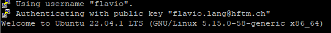  
  
**4. Disable Login with Password**  
`vim /etc/ssh/sshd_config`  
Uncomment PasswordAuhentication and set it to `no` and then restart the service with `sudo service ssh restart`  
When trying to login via putty and the passwort the following error will appear:  
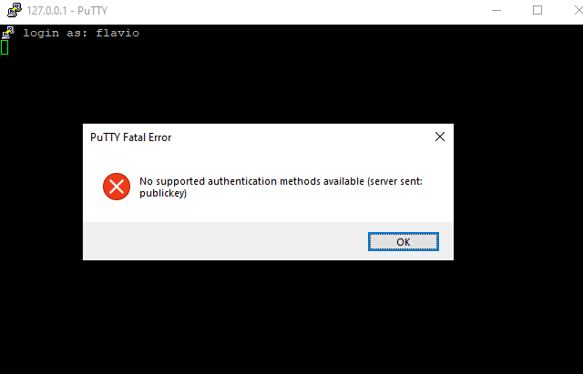

<br>
<br>

## <a name="DisksAndPartitions"></a> Disks and Partitions

**1. Listing existing Disks and Partition**  
`sudo fdisk -l`  
We see the following output:  
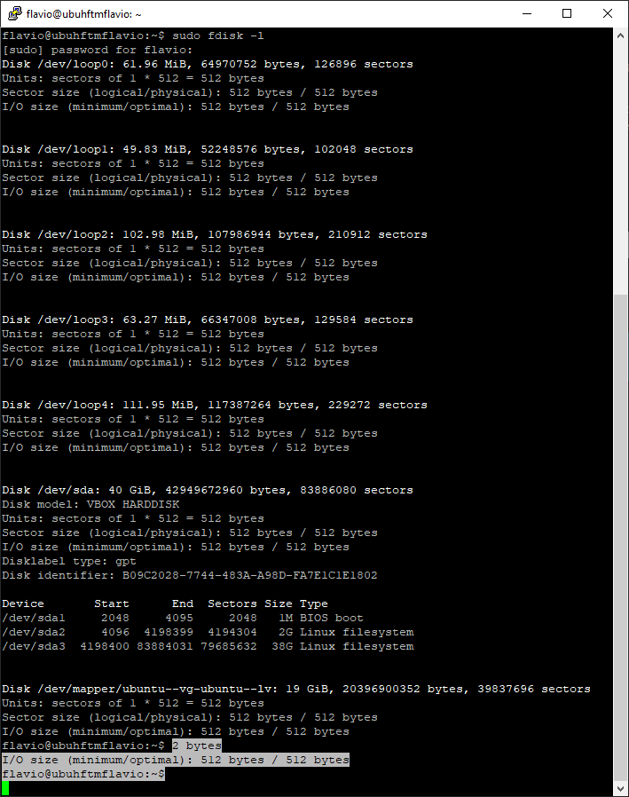

**2. Creating a new virtual Disk**
- While the Vm is turned off: VirtualBox Machine -> Settings -> Storage -> Click on the little Hard Disk plus symbol next to Controller: SATA -> Create -> Virtual Hard Disk
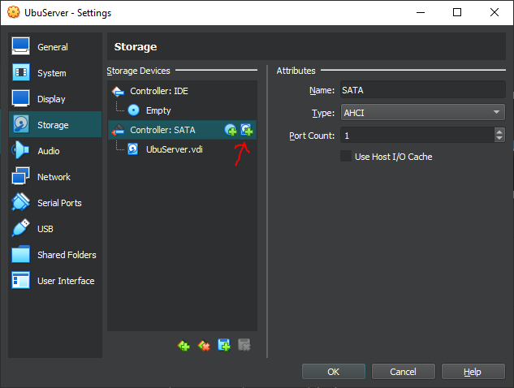  

- Choose a path (Example: C:\Users\flala\VirtualBox VMs\UbuServer\UbuServer_1.vhd) -> 
Set the Size to 5 GB -> Finish -> Select the Created Disk -> Choose  
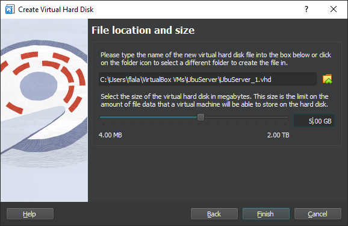  

**3. Partitioning the new Disk**
- If we run `sudo fdisk -l` again and compare it to the output of when we ran it the first time, we will see our newly created disk  
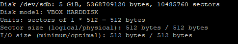
- To partition the new disk we run the following command:  
`sudo fdisk /dev/sdb`  
Now you can enter the following short commands into the presented prompt to configure the partition  
`n` -> this creates a new partition  
`p` -> create primary partition  
`1` -> partition number 1  
First sector -> just press Enter  
Last sector -> just press Enter  
`t` -> to change type  
Hex code or alias -> enter `8e` to create an LVM Partition  
`w` -> write changes

- Running `sudo fdisk -l` againg should now show us our new LVM Partition  
  

**4. Creating a logical volume**
- Create a new physical volume: `sudo pvcreate /dev/sdb1`  
- Create a new Volume Group: `sudo vgcreate vg_hftm /dev/sdb1`
- Check your Work with `sudo vgdisplay`, your new group should be listed as follows:  
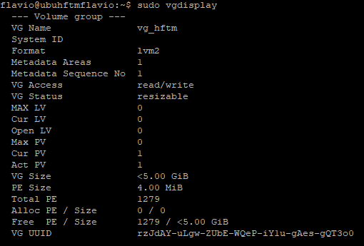  
- Create a new logical volume: `sudo lvcreate –l 100%FREE –n lv_hftm vg_hftm`  
- Running `sudo lvdisplay` should now show the new logical volume as follows:  
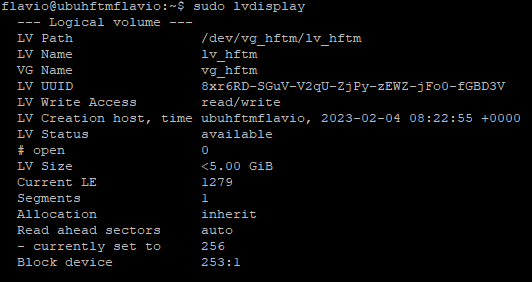  
- Assign a filesystem to the new volume: `sudo mkfs.ext4 /dev/vg_hftm/lv_hftm`  


**5. Mounting the new Disk**
- Create a new folder to mount the disk to: `sudo mkdir /var/www`
- Find the UUID of your Volume: `sudo blkid`  
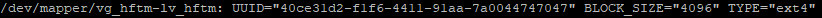
- Edit the file /etc/fstab with your prefered editor -> add the following line to add the volume via UUID  
`/dev/disk/by-uuid/<YOUR_UUID> /var/www ext4 defaults 0 0`
- Mount all available disks: `sudo mount -a` and list them `sudo mount -l`, your volume should now be mounted:  
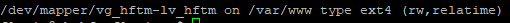

**6. Creating the second Disk**  
Now you can go back and run all the steps again for the second disk we have to create
- In the fstab file, instead of mounting by UUID, we will mount by path, so add the following line to the file:  
 `/dev/mapper/vg_hftm_2-lv_hftm_2 /opt/app ext4 defaults 0 0`  
 - Running `sudo mount -a` and `sudo mount -l` should now show us our newly created and mounted volume:  
 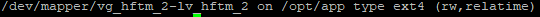  

<br>
<br>

 ## <a name="LempInstall"></a> LEMP installation
 For this section of the workbook i decided to intall the LEMP Stack. I came to this decision because the lightweight and fast nature of this Tech Stack sounds appealing. I also have never worked with this nginx compared to a few years of development experience with Apache. I see this as an opportunity to challenge myself.  
 
 **1. Install Nginx**
 - Run `sudo apt update` and wait for it to complete  
 - Run `sudo apt install nginx`, when prompted press `Y` and Enter to confirm the installation  
 - By running `sudo ufw app list` you will see a list of available nginx app configurations. For our application we will chose the HTTP config
 - Enable the HTTP config by running `sudo ufw allow 'Nginx HTTP'`
 - Run `sudo ufw status`, if the ouptut reads `inactive` run `sudo ufw enable` to activate it

 **2. Port forwarding HTTP**  
 To access the nginx server from your host computer (not the virtualbox server) you need to forward the HTTP Port  
 - Open the Settings of your Virtualbox machine -> Network -> Adapter 1 -> Advanced -> Port Forwarding -> Add a new entry with the following parameters:  
 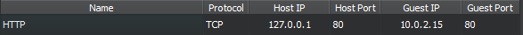  
 - Now open your Web Browser of choice and enter the following URL: `http://127.0.0.1`  
 - You should now see nginx's lovely Init Page:  
 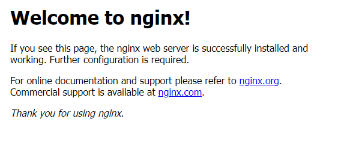

 **3. MySQL installation**
 - `sudo apt install mysql-server`, When prompted, confirm the installation by pressing `Y` and then Enter
 - `sudo mysql` should now yield the following output:  
 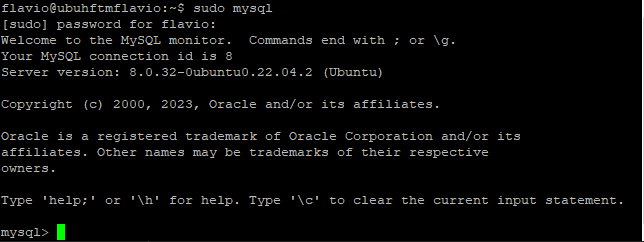  
 - To exit the SQL Shell type `exit`

 **4. PHP installation**  
 - Run `sudo apt install php8.1-fpm php-mysql` and press `Y` and Enter to confirm the installation
 - Create a new file `info.php` in your servers home directory and copy the following text into it:
 ```
 <?php
phpinfo();
```
- Open `http://127.0.0.1/info.php` in your browser of choice and you should get the following page:  
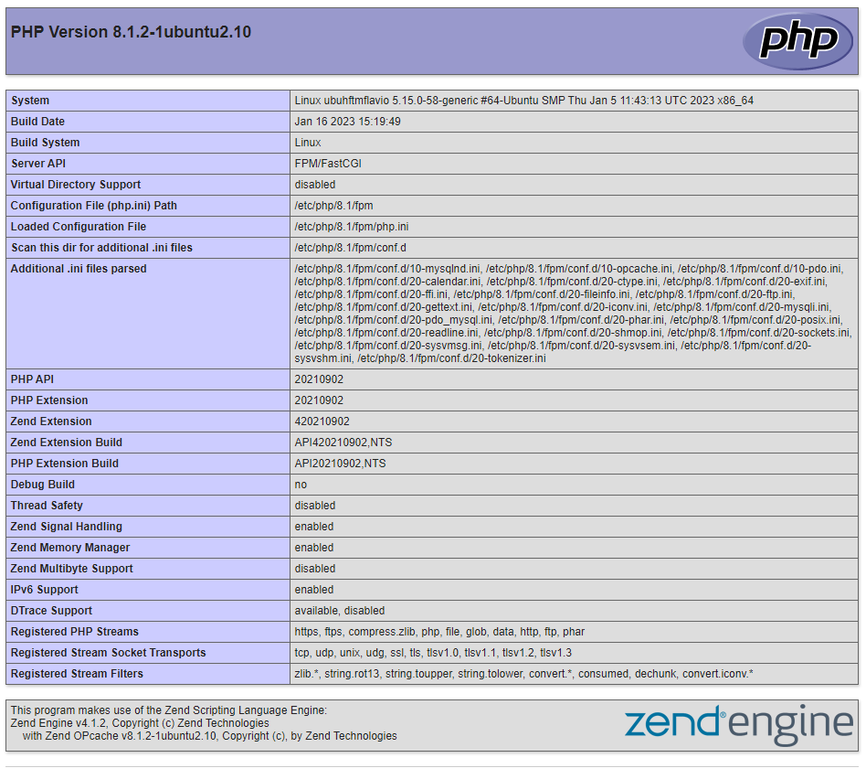

<br>
<br>

## <a name="user-management"></a> User management  
  
**1. Creating the groups**  
First we need to create some goups into which our new users can be put in.  
This can be done with the following commands:  
`sudo groupadd Technik`  
`sudo groupadd Verkauf`  
`sudo groupadd HR`  
`sudo groupadd Projekt`  
`sudo groupadd Firma`

To verify that our new groups have been created we can run the following command:  

`grep 'Technik\|Verkauf\|HR\|Projekt\|Firma' /etc/group`

The output should look something like this:  
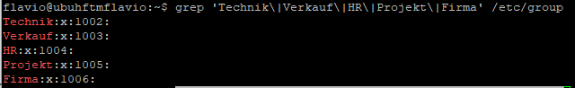  

**2. Create users**  
Now we need to create the users with their corresponding groups:  
`Hans   => Technik`  
`Peter  => Verkauf`  
`Alfred => Verkauf`  
`Georg  => HR, Projekt`  
`Markus => HR`  
`Albert => Projekt`
`Christine  => Technik, Projekt`  
`Beate  => Technik, Verkauf, HR, Projekt`  

Aditionally every user has the main group `Firma`  
To achieve this we use the useradd command. With this command we can define the new users main group `-g`, any additional groups `-G`, and create a new home directory automatically `-m`  

```
flavio@ubuhftmflavio:~$ sudo useradd -g Firma -G Technik -m Hans
flavio@ubuhftmflavio:~$ sudo useradd -g Firma -G Verkauf -m Peter
flavio@ubuhftmflavio:~$ sudo useradd -g Firma -G Verkauf -m Alfred
flavio@ubuhftmflavio:~$ sudo useradd -g Firma -G HR,Projekt -m Georg
flavio@ubuhftmflavio:~$ sudo useradd -g Firma -G HR -m Markus
flavio@ubuhftmflavio:~$ sudo useradd -g Firma -G Projekt -m Albert
flavio@ubuhftmflavio:~$ sudo useradd -g Firma -G Technik,Projekt -m Christine
flavio@ubuhftmflavio:~$ sudo useradd -g Firma -G Technik,Verkauf,HR,Projekt -m Beate
```   
Now we need to set a password for each user. For simplicity i will use the password `123` for every user.
```
flavio@ubuhftmflavio:~$ sudo passwd Hans
New password:
Retype new password:
passwd: password updated successfully
flavio@ubuhftmflavio:~$
```
We have to repeat this step for every user.
Finally we can verify our users and groups as follows:  
``` 
flavio@ubuhftmflavio:~$ sudo groups Hans Peter Alfred Georg Markus Albert Christine Beate
Hans : Firma Technik
Peter : Firma Verkauf
Alfred : Firma Verkauf
Georg : Firma HR Projekt
Markus : Firma HR
Albert : Firma Projekt
Christine : Firma Technik Projekt
Beate : Firma Technik Verkauf HR Projekt
```
**3. Creating the directory Tree**  
For our example we will create the following directory tree:  
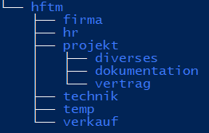  
```
flavio@ubuhftmflavio:/$ sudo mkdir -p /hftm/{firma,hr,projekt,technik,temp,verkauf}
flavio@ubuhftmflavio:/$ sudo mkdir -p/hftm/projekt/{diverses,dokumentation,vertrag}
```  
We can check our newly created directory tree with the handy command `tree` (This needs to be installed first tough)  
```
flavio@ubuhftmflavio:/$ tree /hftm/
/hftm/
├── firma
├── hr
├── projekt
│   ├── diverses
│   ├── dokumentation
│   └── vertrag
├── technik
├── temp
└── verkauf

9 directories, 0 files
```  
**4. Setting permissions**  
Next we need to set the permissions of the newly created folders to the following specifications:  
```
- No unneeded permissions should be set (principle of least privileges)
- Every folder belongs to the root user
- Every group has full privileges to the folder of the same name
- The user hans should be locked 5 days after his password expires, poor Hans :(
- The user Markus has additional read-privileges on the filder Verkauf
- Every user can create files in the temp forld. But each user can only delete files they created themselves
- Newly created folders/files in the folder Technik should automatically inherit the group of its parent folder
```
First we will change the permissions for all the folders, so the root user and the group have full privileges. On the directory Technik we will user SGID, so newly created folders/files inherit the group of the folder.  
``` 
flavio@ubuhftmflavio:/$ sudo chmod 2770 /hftm/technik/
flavio@ubuhftmflavio:/$ sudo chmod 0770 /hftm/verkauf
flavio@ubuhftmflavio:/$ sudo chmod 0770 /hftm/hr
flavio@ubuhftmflavio:/$ sudo chmod 0770 /hftm/projekt
flavio@ubuhftmflavio:/$ sudo chmod 0770 /hftm/firma
flavio@ubuhftmflavio:/$ sudo chmod 0770 /hftm/temp
```   
On the folder temp i will additionally set a sticky bit, so the users can only delete folders/files they created themselves.

`flavio@ubuhftmflavio:/$ sudo chmod +t /hftm/temp/`  

Now we need to assign a group to each folder.  

``` 
flavio@ubuhftmflavio:/$ sudo chgrp Technik /hftm/technik/
flavio@ubuhftmflavio:/$ sudo chgrp Verkauf /hftm/verkauf/
flavio@ubuhftmflavio:/$ sudo chgrp HR /hftm/hr/
flavio@ubuhftmflavio:/$ sudo chgrp Projekt /hftm/projekt/
flavio@ubuhftmflavio:/$ sudo chgrp Firma /hftm/firma/
flavio@ubuhftmflavio:/$ sudo chgrp Firma /hftm/temp/
```  
To verify our permissions we use the command `ls -l`  
```
flavio@ubuhftmflavio:/$ sudo ls -l /hftm/
total 24
drwxrwx--- 2 root Firma   4096 Feb 24 17:00 firma
drwxrwx--- 2 root HR      4096 Feb 24 17:00 hr
drwxrwx--- 5 root Projekt 4096 Feb 24 17:01 projekt
drwxrws--- 2 root Technik 4096 Feb 24 17:00 technik
drwxrwx--T 2 root Firma   4096 Feb 24 17:00 temp
drwxrwx--- 2 root Verkauf 4096 Feb 24 17:00 verkauf
```  
Next we need to make sure the user Hans gets locked 5 days after his password expires.

-M sets the maximum number of days until the password needs to be changed  
-I sets the number of days of inactivity after the password expires before the account is locked.  

`flavio@ubuhftmflavio:/$ sudo chage -M 30 -I 5 Hans`  
To verify:  
```
flavio@ubuhftmflavio:/$ sudo chage -l Hans
Last password change                                    : Feb 24, 2023
Password expires                                        : Mar 26, 2023
Password inactive                                       : Mar 31, 2023
Account expires                                         : never
Minimum number of days between password change          : 0
Maximum number of days between password change          : 30
Number of days of warning before password expires       : 7
```

To set special read permissions for the user Markus i need to use `setfacl` since this functionality seems to not be supported out of the box. <a>https://askubuntu.com/questions/487527/give-specific-user-permission-to-write-to-a-folder-using-w-notation</a>  
`flavio@ubuhftmflavio:/$ sudo setfacl -m u:Markus:rx /hftm/verkauf/`  
**4. Verifying Permissions**
First i will log in as Hans and check if i can access the folders technik, firma and temp. Then i make sure that i cant open the folders verkauf, hr and projekt.  
```
flavio@ubuhftmflavio:/hftm$ su Hans
Password:
Hans@ubuhftmflavio:/hftm$ cd technik/
Hans@ubuhftmflavio:/hftm/technik$ cd ../firma/
Hans@ubuhftmflavio:/hftm/firma$ cd ../temp/
Hans@ubuhftmflavio:/hftm/temp$ cd ../verkauf/
bash: cd: ../verkauf/: Permission denied
Hans@ubuhftmflavio:/hftm/temp$ cd ../hr
bash: cd: ../hr: Permission denied
Hans@ubuhftmflavio:/hftm/temp$ cd ../projekt/
bash: cd: ../projekt/: Permission denied
Hans@ubuhftmflavio:/hftm/temp$
```  
Next we will navigate to the temp folder and create two files. Then we will try to delete one of the files, which should succeed.

```
Hans@ubuhftmflavio:/hftm/temp$ touch file1
Hans@ubuhftmflavio:/hftm/temp$ touch file2
Hans@ubuhftmflavio:/hftm/temp$ ls
file1  file2
Hans@ubuhftmflavio:/hftm/temp$ rm file1
Hans@ubuhftmflavio:/hftm/temp$ ls
file2
```  
Now i will log in as Markus and try to delete the remaining file. This should not succeed.
```
flavio@ubuhftmflavio:/hftm/temp$ su Markus
Password:
Markus@ubuhftmflavio:/hftm/temp$ ls
file2
Markus@ubuhftmflavio:/hftm/temp$ rm file2
rm: remove write-protected regular empty file 'file2'? yes
rm: cannot remove 'file2': Operation not permitted
```
Now i will log in as Alfred and create a new file in the folder verkauf. Then i will switch to Markus and try to cat the file. This should display the content of the file. NExt i will try to remove the file, which will fail.  
```
flavio@ubuhftmflavio:/hftm/temp$ su Alfred
Password:
Alfred@ubuhftmflavio:/hftm/temp$ cd ../verkauf/
Alfred@ubuhftmflavio:/hftm/verkauf$ touch testFile
Alfred@ubuhftmflavio:/hftm/verkauf$ vim testFile
Alfred@ubuhftmflavio:/hftm/verkauf$ su Markus
Password:
Markus@ubuhftmflavio:/hftm/verkauf$ cat testFile
This is a test file. If you see this you have successfully opened this awesome testFile.
Markus@ubuhftmflavio:/hftm/verkauf$ rm testFile
rm: remove write-protected regular file 'testFile'? yes
rm: cannot remove 'testFile': Permission denied
Markus@ubuhftmflavio:/hftm/verkauf$
```

## <a name="package-management"></a> Package Management  
**1. Adding a repository**  
First we need to add the baseurl to /etc/apt/sources.list  
`sudo vim /etc/apt/sources.list`
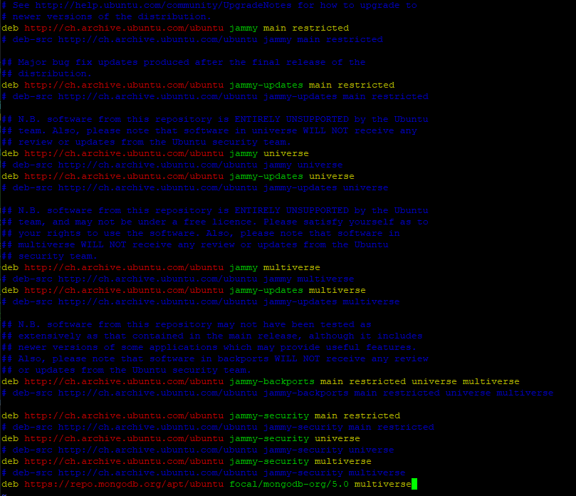  
Then we need to add the gpg key  
`wget -qO- https://www.mongodb.org/static/pgp/server-5.0.asc | sudo apt-key add -`  
**2. Installing mongodb**  
The next step is to install the mongodb-org package. But this fails because of some unmet dependencies.  
```
The following packages have unmet dependencies:
 mongodb-org-mongos : Depends: libssl1.1 (>= 1.1.1) but it is not installable
 mongodb-org-server : Depends: libssl1.1 (>= 1.1.1) but it is not installable
 mongodb-org-shell : Depends: libssl1.1 (>= 1.1.1) but it is not installable
E: Unable to correct problems, you have held broken packages.
```  
So we will have to install those dependencies manually by adding `deb http://security.ubuntu.com/ubuntu focal-security main` to `/etc/apt/sources.list` and then runnung `sudo apt-get install libssl1.1`  
After this is completed, we can install mongodb with `sudo apt-get install mongodb-org`  
Now we can start the service and check its status  
```
flavio@ubuhftmflavio:~$ sudo systemctl start mongod
flavio@ubuhftmflavio:~$ sudo systemctl status mongod
● mongod.service - MongoDB Database Server
     Loaded: loaded (/lib/systemd/system/mongod.service; disabled; vendor preset: enabled)
     Active: active (running) since Fri 2023-02-24 20:57:10 UTC; 4min 20s ago
       Docs: https://docs.mongodb.org/manual
   Main PID: 1544 (mongod)
     Memory: 220.4M
        CPU: 971ms
     CGroup: /system.slice/mongod.service
             └─1544 /usr/bin/mongod --config /etc/mongod.conf

Feb 24 2':57:10 hv-ubnt systemd[1]: Started MongoDB Database Server.
```  
Finally we need to persist the service  
```
flavio@ubuhftmflavio:~$ sudo systemctl enable mongod
Created symlink /etc/systemd/system/multi-user.target.wants/mongod.service → /lib/systemd/system/mongod.service.
```  

**3. The difference between snap and apt**  
Snaps contain all the dependencies a package needs to run, while apt packages expect the user to install all the needed dependencies. This makes it easy to install a complete software package. There is no hassle with dependencies. On the other hand you dont have the control of which exact version of the dependency you are installing.


<!-- MongoDB FIX https://www.mongodb.com/community/forums/t/installing-mongodb-over-ubuntu-22-04/159931/5 -->

